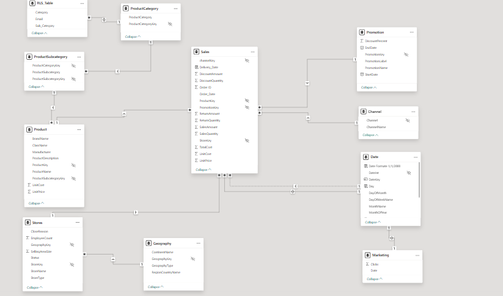
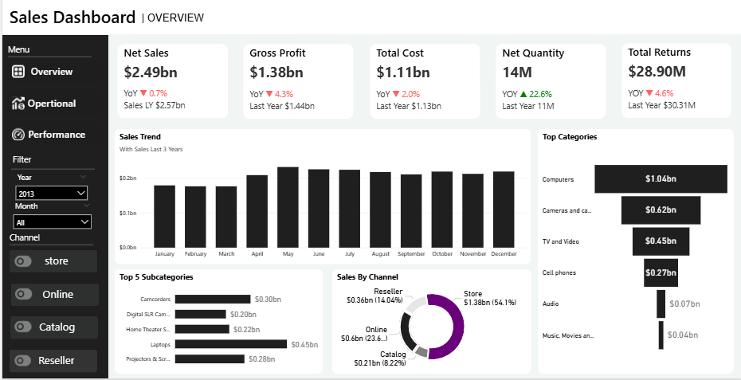
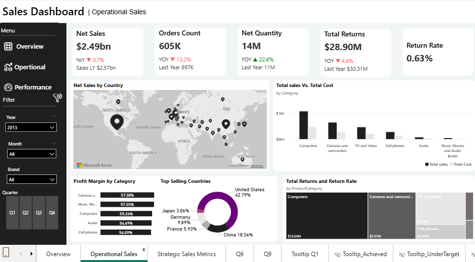
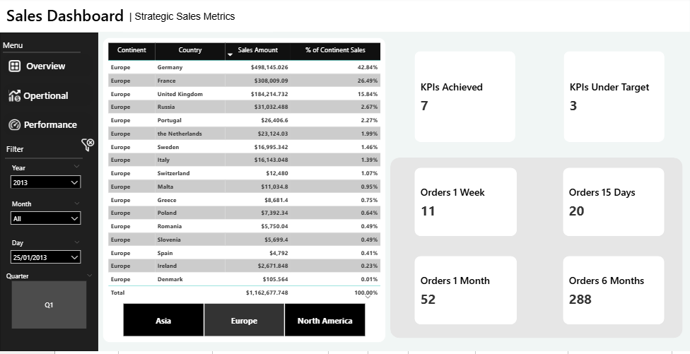
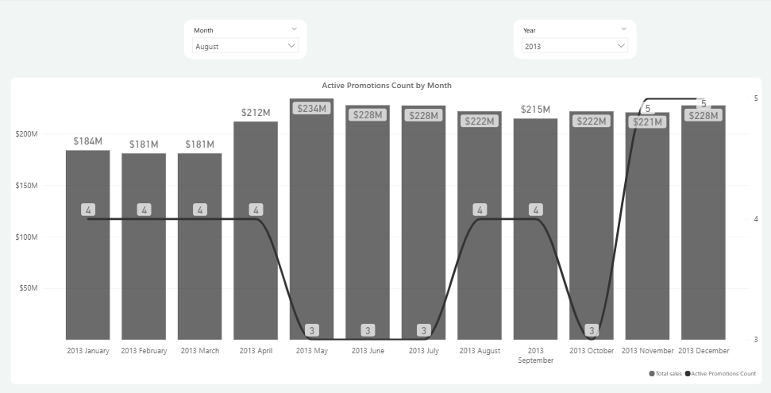
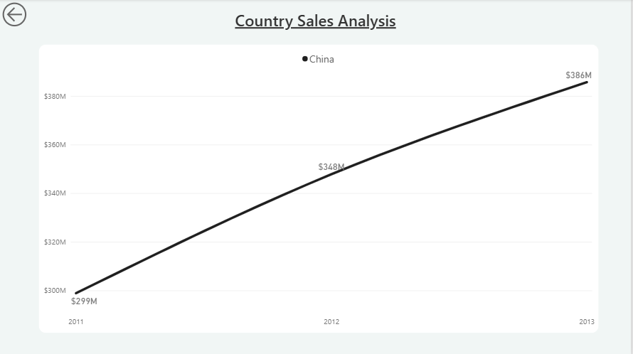
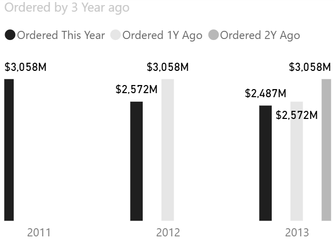

# 🌐 Global Enterprise Sales & Business Intelligence Pipeline

An enterprise-grade Power BI business intelligence solution designed to analyze multi-million dollar global retail operations. This project transforms highly normalized relational sales data into an interactive executive platform tracking dynamic KPIs, temporal trends, and cross-regional performance.

---

## 📊 Solution Architecture & Previews
*A comprehensive look at the ecosystem, from data warehouse design to interactive analytical planes:*

### 📐 Robust Star Schema Data Modeling
Engineered an optimized data architecture anchoring a central `Sales` fact table connected to extensive dimension networks (`Product`, `Store`, `Geography`, `Promotion`, `Channel`, `Date`, and `Marketing`). Implemented **Row-Level Security (RLS)** via `RLS_Table` to restrict categorical viewing based on corporate identity.

---

### 📈 Interactive Executive Dashboards

| 1. Strategic Sales Overview | 2. Operational Deep-Dive |
|---|---|
|  |  |

| 3. Strategic Performance Metrics | 4. Active Promotions Count by Month |
|---|---|
|  |  |

---

### 🔍 Advanced Analytical Breakdowns

| Country Sales Trends (e.g., China) | Advanced YoY Sales Target Variance |
|---|---|
|  |  |

---

## 🛠️ Technical Implementation & Features
* **Advanced DAX & Time Intelligence:** Formulated custom measures for Year-over-Year (**YoY %**) growth, Net Sales ($2.49bn), Gross Profit ($1.38bn), and dynamic rolling periods (Orders 1 Week / 15 Days / Month / 6 Months).
* **Data Modeling:** Complex Star Schema architecture with strict bidirectional filter control and RLS data masking.
* **UI/UX Engineering:** Built a clean corporate interface featuring a synchronized left-rail navigation menu, structural tooltips (`Tooltip_Achieved`, `Tooltip_UnderTarget`), and localized slicing parameters (Year, Month, Brand, Channel).
* **Promotion & Channel Analytics:** Mapped total sales against active promotion counts to evaluate marketing campaign efficiency and distribution funnel health (Store vs. Online vs. Reseller vs. Catalog).

---

## 📂 Repository Contents
* 📊 `Enterprise_Sales_Analytics.pbix` - Complete Power BI dashboard with full data model and DAX scripts.
* 🖼️ `Images/` - High-fidelity directory containing all strategic visual previews.
* 📝 `README.md` - Technical project documentation.

---
*Generated as part of my Advanced Data Analytics portfolio.*
